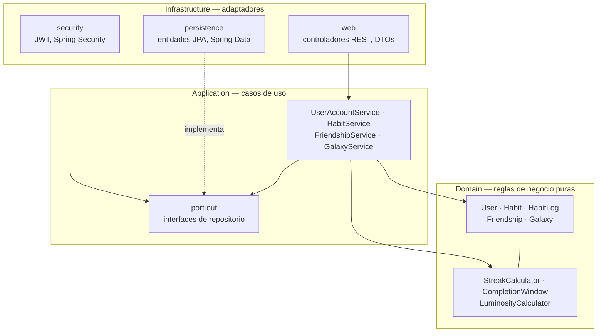
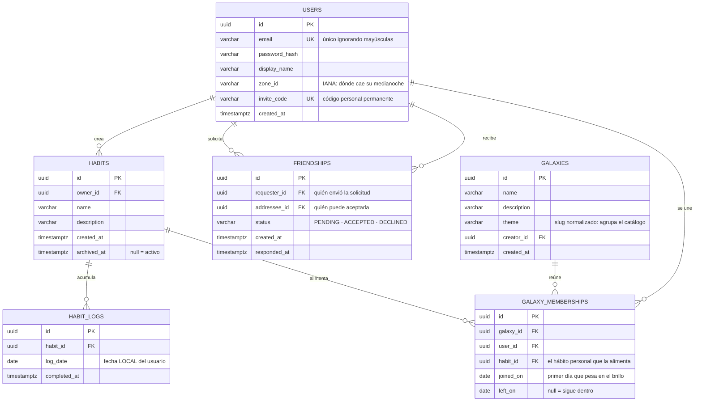

# Habit Tracker — Forja de Constelaciones

Backend de una aplicación de seguimiento de hábitos donde cada día cumplido es una
estrella y cada racha sostenida traza una constelación.

API REST en Java 21 y Spring Boot 4 sobre PostgreSQL, construida siguiendo Arquitectura
Limpia.

## Arranque rápido

Requisitos: JDK 21 o superior y Docker.

```bash
# 1. Levantar la base de datos
cp .env.example .env          # y rellenar los valores
docker compose up -d postgres

# 2. Definir la clave de firmado JWT (la aplicación no arranca sin ella, a propósito)
export HABITS_SECURITY_JWT_SECRET="$(openssl rand -base64 48)"

# 3. Arrancar (Flyway crea el esquema en el primer arranque)
./mvnw spring-boot:run
```

La API queda disponible en `http://localhost:8080` y su documentación navegable en
`http://localhost:8080/swagger-ui.html` (esquema en `/v3/api-docs`).

Para consumirla desde un frontend en el navegador hay que declarar su origen; la lista
está **vacía por defecto**, porque sin cliente desplegado lo correcto es no abrir nada:

```bash
export HABITS_WEB_CORS_ALLOWED_ORIGINS="http://localhost:5173"
```

Para ejecutar también la aplicación dentro de Docker:
`docker compose --profile full up --build`.

### Pruebas

```bash
./mvnw verify
```

Las pruebas de integración levantan su propio PostgreSQL con Testcontainers, así que
necesitan Docker en marcha. Las de dominio y las de arquitectura no dependen de nada
externo y se ejecutan en segundos.

## Arquitectura

Las dependencias apuntan siempre hacia dentro. La regla no es una convención escrita en
un documento: la verifica `LayeringTest` con ArchUnit en cada compilación, y el build
falla si se rompe.



El dominio no importa Spring, JPA ni ninguna librería de framework: se compila y se
prueba por sí solo. Los casos de uso son objetos planos que hablan con puertos; quién los
implementa se decide en `infrastructure/config/ApplicationConfig`.

## Modelo de datos



La pareja `(habit_id, log_date)` es única: un hábito se cumple una sola vez al día, y es
la base de datos quien lo garantiza, no únicamente el código.

En `friendships` el índice único se aplica sobre el par normalizado con
`LEAST`/`GREATEST`, de forma que `(A,B)` y `(B,A)` colisionan. Así, dos solicitudes
cruzadas simultáneas no pueden crear dos relaciones entre las mismas personas.

En `galaxy_memberships` el índice único es **parcial** (`WHERE left_on IS NULL`): impide
pertenecer dos veces a la vez a la misma galaxia, pero permite volver a entrar después de
haber salido, que es justo lo que hace falta para reconstruir el brillo de días pasados.

Ni las rachas ni el brillo **se almacenan**. Se recalculan a partir de los registros en
cada consulta, de modo que nunca pueden quedar desincronizados con la realidad.

## Reglas del motor de rachas

- Un hábito es **diario**: se cumple o no se cumple cada día.
- El día corta a la **medianoche de la zona horaria del usuario**, no la del servidor.
- Se puede marcar **hoy o ayer**. Ni el futuro, ni nada más antiguo.
- **Un día fallado corta la racha.** No hay días de gracia ni congelaciones.
- La racha sigue viva si el último cumplimiento fue ayer: mientras el día en curso no
  termine, todavía se puede sostener.
- Cada **30 días consecutivos** cierran una constelación, que queda ganada para siempre
  aunque la racha se rompa después.

Toda esta lógica vive en `domain/streak/StreakCalculator` y `domain/habit/CompletionWindow`,
y está cubierta por pruebas unitarias que no necesitan base de datos.

## Funcionamiento social

Cada usuario recibe al registrarse un **código personal permanente** con formato
`ABCD-2345`. Quien lo conozca puede enviarle una solicitud, que solo se convierte en
amistad cuando el destinatario la acepta: nadie observa el progreso de otro sin haberlo
consentido. Si el código se difunde más de la cuenta, se regenera y el anterior deja de
funcionar.

El alfabeto del código excluye `O`, `0`, `I` y `1`, que son la principal fuente de errores
al dictarlo en voz alta o teclearlo a mano.

**Un amigo solo ve cifras agregadas**: tu mejor racha viva, tu récord histórico, estrellas
totales, constelaciones cerradas y cuántos hábitos llevas. Nunca los nombres de esos
hábitos. «Terapia» o «dejar de fumar» no deberían filtrarse por el hecho de aceptar una
solicitud, y la motivación social se sostiene igual con los números.

Las solicitudes rechazadas se conservan en lugar de borrarse, de modo que no se pueda
insistir en bucle. Eliminar la amistad sí borra la relación, lo que permite volver a
invitarse más adelante.

## Constelaciones compartidas

Una galaxia es un hábito que varios sostienen a la vez. Cada día se dibuja una estrella
cuyo **brillo es proporcional a cuánta gente cumplió**: se apaga cuando no cumple nadie,
pero nunca desaparece.

```
lun  mar  mié  jue  vie  sáb  dom
 ●    ◉    ◐    ○    ◉    ●    ◐      ● todos   ◉ mayoría
4/4  3/4  2/4  0/4  3/4  4/4  1/4     ◐ algunos ○ nadie
```

Es deliberado que no sea «todos o nada». Con esa regla, la primera persona que falla
anula el esfuerzo del resto, y a partir de ahí lo racional es no molestarse; con una
escala, tu cumplimiento siempre suma aunque el grupo se caiga. El nivel máximo se reserva
al pleno, porque «hoy cumplimos todos» es el único día que merece distinguirse de un
vistazo.

**El denominador de cada día son los miembros que había _ese_ día**, no los de hoy. Por
eso las filas de quienes se van no se borran: si se usara el recuento actual, entrar en un
grupo oscurecería retroactivamente meses en los que nadie hizo nada distinto, y el mapa
dejaría de ser un registro de lo que pasó.

Unirse **no crea un seguimiento paralelo**: enlaza un hábito personal, o lo crea si no
existía. Un único registro alimenta a la vez la racha propia y el brillo del grupo, de
modo que no puede darse el caso de ver dos rachas distintas del mismo esfuerzo según la
pantalla. Salir conserva el hábito —lo empezó el usuario y las estrellas ganadas son
suyas— y archivar el hábito saca de las galaxias que alimentaba, para no pesar en el
denominador sin poder ya marcar nada.

Las galaxias son **abiertas**: cualquiera puede descubrirlas por el catálogo de temas y
unirse. Eso relaja a propósito la regla de la sección anterior, así que lo que se expone
está acotado: dentro de una galaxia se ve el **nombre visible** y el cumplimiento del
hábito compartido, y nada más. Ni el email, ni el código de invitación, ni el resto de
hábitos, ni las rachas de nadie —esas viven en el panel personal y repetirlas aquí sería
ruido además de un perfil gratis para un desconocido.

Al tocar un día se listan **quienes cumplieron**, nunca quienes faltaron. La información
deducible es la misma, pero una lista de ausentes convierte el mapa en un tablón de
reproches.

### El catálogo

Los temas se ordenan por cuánta gente los sostiene de verdad, no por una lista curada:
la popularidad sale de contar miembros activos. Elegir un tema del catálogo **no te mete
en un grupo global**, crea tu propia galaxia sobre ese tema; el catálogo orienta, pero el
brillo mide siempre a tu grupo real.

Los temas se normalizan a un slug sin tildes, de modo que «Gym», «gym » y «GYM» son el
mismo. Sin eso el recuento se fragmenta en variantes y ningún tema llega a parecer
popular. Seis temas sugeridos aparecen al final con cero miembros para que el catálogo no
salga vacío el primer día, sin fingir una popularidad que todavía no tienen.

### Límite conocido

En una galaxia abierta muy concurrida el brillo deja de ser presión de grupo y se
convierte en una estadística: un ~40% constante no interpela a nadie. El modelo aguanta
la carga —el mapa se resuelve en tres consultas sea cual sea el número de miembros—, pero
si en uso real las galaxias grandes se sienten anónimas, la salida natural es filtrar el
mapa a los amigos que hay dentro del grupo. Las amistades ya existen, así que es
básicamente una condición más en la consulta.

## API

Todos los endpoints salvo `/auth/register` y `/auth/login` requieren la cabecera
`Authorization: Bearer <token>`.

| Método   | Ruta                              | Descripción                                |
|----------|-----------------------------------|--------------------------------------------|
| `POST`   | `/api/v1/auth/register`           | Crear cuenta                               |
| `POST`   | `/api/v1/auth/login`              | Obtener tokens de acceso y de refresco     |
| `POST`   | `/api/v1/auth/refresh`            | Renovar el acceso (rota el de refresco)    |
| `POST`   | `/api/v1/auth/logout`             | Cerrar sesión (revoca el de refresco)      |
| `GET`    | `/api/v1/auth/me`                 | Datos del usuario autenticado              |
| `GET`    | `/api/v1/habits`                  | Hábitos activos con su progreso            |
| `POST`   | `/api/v1/habits`                  | Crear hábito                               |
| `GET`    | `/api/v1/habits/{id}`             | Un hábito con su progreso                  |
| `PUT`    | `/api/v1/habits/{id}`             | Renombrar o editar la descripción          |
| `DELETE` | `/api/v1/habits/{id}`             | Archivar (no borra: conserva el historial) |
| `POST`   | `/api/v1/habits/{id}/completions` | Marcar como cumplido (idempotente)         |
| `DELETE` | `/api/v1/habits/{id}/completions` | Deshacer un cumplimiento                   |

### Social

| Método   | Ruta                                       | Descripción                          |
|----------|--------------------------------------------|--------------------------------------|
| `GET`    | `/api/v1/me/invite-code`                   | Tu código personal                   |
| `POST`   | `/api/v1/me/invite-code`                   | Regenerarlo (invalida el anterior)   |
| `POST`   | `/api/v1/friend-requests`                  | Enviar solicitud usando un código    |
| `GET`    | `/api/v1/friend-requests`                  | Solicitudes recibidas sin responder  |
| `GET`    | `/api/v1/friend-requests/sent`             | Solicitudes enviadas sin respuesta   |
| `POST`   | `/api/v1/friend-requests/{id}/accept`      | Aceptar (solo el destinatario)       |
| `POST`   | `/api/v1/friend-requests/{id}/decline`     | Rechazar (solo el destinatario)      |
| `GET`    | `/api/v1/friends`                          | Amigos con su progreso agregado      |
| `DELETE` | `/api/v1/friends/{userId}`                 | Eliminar la amistad                  |

### Constelaciones compartidas

| Método   | Ruta                                          | Descripción                            |
|----------|-----------------------------------------------|----------------------------------------|
| `GET`    | `/api/v1/galaxies/catalog`                    | Temas ordenados por popularidad real   |
| `GET`    | `/api/v1/galaxies/discover?theme=`            | Galaxias abiertas a las que unirse     |
| `POST`   | `/api/v1/galaxies`                            | Crear una (mete dentro al creador)     |
| `GET`    | `/api/v1/galaxies`                            | Las tuyas                              |
| `GET`    | `/api/v1/galaxies/{id}?days=30`               | Mapa de brillo y miembros              |
| `GET`    | `/api/v1/galaxies/{id}/days/{fecha}`          | Quiénes iluminaron ese día             |
| `POST`   | `/api/v1/galaxies/{id}/members`               | Unirse enlazando un hábito propio      |
| `DELETE` | `/api/v1/galaxies/{id}/members/me`            | Salir (el hábito se conserva)          |

Un hábito ajeno responde `404` y nunca `403`: distinguir ambos casos filtraría qué
identificadores existen. Lo mismo aplica a las solicitudes de amistad de terceros.

### Ejemplo

```bash
curl -X POST localhost:8080/api/v1/auth/register \
  -H 'Content-Type: application/json' \
  -d '{"email":"tu@email.com","password":"una-clave-larga","displayName":"Tu","zoneId":"America/Lima"}'

TOKEN=$(curl -s -X POST localhost:8080/api/v1/auth/login \
  -H 'Content-Type: application/json' \
  -d '{"email":"tu@email.com","password":"una-clave-larga"}' | jq -r .accessToken)

curl -X POST localhost:8080/api/v1/habits \
  -H "Authorization: Bearer $TOKEN" -H 'Content-Type: application/json' \
  -d '{"name":"Meditar 10 minutos"}'
```

## Sesiones

El token de acceso dura 30 minutos. El de refresco dura 30 días y sirve para renovarlo
sin volver a pedir la contraseña.

Es un **valor opaco y aleatorio de 256 bits, no un JWT**, y eso resuelve dos cosas a la
vez: no puede colarse como token de acceso —el filtro lo descarta porque ni siquiera es
un JWT—, y al no llevar información dentro, revocarlo es marcar una fila. De esa fila
solo se guarda su hash, igual que con las contraseñas: leer la base de datos no basta
para suplantar a nadie.

Cada renovación **rota** el token: el presentado se revoca y se entrega otro. Si un token
ya revocado vuelve a presentarse, se cierran **todas** las sesiones de ese usuario. Que
aparezca dos veces significa que existe una copia, y no hay forma de saber cuál de las
dos partes es la legítima.

## Decisiones técnicas

- **Flyway es la única fuente de verdad del esquema.** Hibernate se limita a validarlo
  (`ddl-auto: validate`), de forma que una entidad desalineada rompe el arranque en vez
  de corromper datos en silencio.
- **La aplicación no arranca sin `HABITS_SECURITY_JWT_SECRET`.** Es preferible un fallo
  ruidoso al arrancar que una clave por defecto que termine llegando a producción.
- **Los hábitos se archivan, nunca se borran.** Sus registros son el historial del
  usuario y las constelaciones ya ganadas no deberían desaparecer.
- **El login no distingue entre email inexistente y contraseña incorrecta**, para no
  permitir enumerar qué cuentas están registradas.
- **Sin base de datos de grafos.** Las amistades son una tabla relacional; se
  reconsiderará únicamente si aparecen consultas de grafo reales, como sugerencias de
  amigos de amigos.
- **Ni las rachas ni el brillo se persisten.** Ambos son funciones puras sobre los
  registros (`StreakCalculator`, `LuminosityCalculator`), así que no existe una copia que
  pueda quedar desincronizada ni una columna que reparar cuando cambien las reglas.
- **Archivar un hábito cierra las pertenencias que alimentaba.** Esto acopla el caso de
  uso de hábitos al de galaxias; lo limpio sería un evento de dominio, pero no compensa
  montar esa infraestructura para un único caso. Queda anotado en `ApplicationConfig`.
- **Las transacciones se declaran con un puerto, no con `@Transactional`.** Los casos de
  uso son POJOs y la anotación obligaría a importar Spring en la capa de aplicación, que
  es justo lo que `LayeringTest` prohíbe. `TransactionRunner` deja la frontera visible al
  leer el método, en vez de depender de un proxy que además se desactiva en silencio
  cuando un método se llama a sí mismo.
- **Marcar un hábito delega la unicidad en la base de datos.** Comprobar y después
  escribir deja una ventana entre ambas consultas; un doble toque acabaría en error en
  lugar de en la operación idempotente que se promete.

## Estado

| Área                                            | Estado    |
|-------------------------------------------------|-----------|
| Modelado de datos y arquitectura                | Completo  |
| Entorno Docker, CI y escaneo de secretos        | Completo  |
| Usuarios, autenticación y CRUD de hábitos       | Completo  |
| Motor de rachas y constelaciones                | Completo  |
| Amistades, códigos de invitación y panel social | Completo  |
| Constelaciones compartidas y mapa de brillo     | Completo  |
