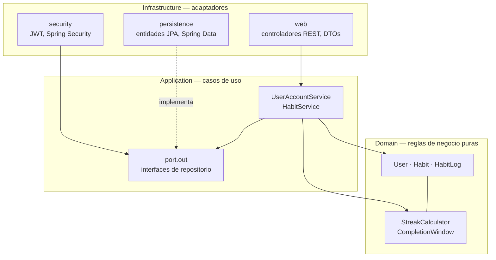
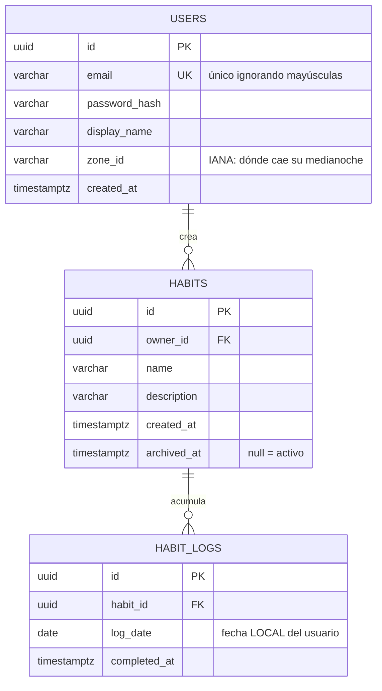

# Habit Tracker — Forja de Constelaciones

Backend de una aplicación de seguimiento de hábitos donde cada día cumplido es una
estrella y cada racha sostenida traza una constelación.

API REST en Java 21 y Spring Boot 4 sobre PostgreSQL, construida siguiendo Arquitectura
Limpia.

## Arranque rápido

Requisitos: JDK 21 o superior y Docker.

```bash
# 1. Levantar la base de datos
cp .env.example .env          # y rellenar los valores
docker compose up -d postgres

# 2. Definir la clave de firmado JWT (la aplicación no arranca sin ella, a propósito)
export HABITS_SECURITY_JWT_SECRET="$(openssl rand -base64 48)"

# 3. Arrancar (Flyway crea el esquema en el primer arranque)
./mvnw spring-boot:run
```

La API queda disponible en `http://localhost:8080`.

Para ejecutar también la aplicación dentro de Docker:
`docker compose --profile full up --build`.

### Pruebas

```bash
./mvnw verify
```

Las pruebas de integración levantan su propio PostgreSQL con Testcontainers, así que
necesitan Docker en marcha. Las de dominio y las de arquitectura no dependen de nada
externo y se ejecutan en segundos.

## Arquitectura

Las dependencias apuntan siempre hacia dentro. La regla no es una convención escrita en
un documento: la verifica `LayeringTest` con ArchUnit en cada compilación, y el build
falla si se rompe.



El dominio no importa Spring, JPA ni ninguna librería de framework: se compila y se
prueba por sí solo. Los casos de uso son objetos planos que hablan con puertos; quién los
implementa se decide en `infrastructure/config/ApplicationConfig`.

## Modelo de datos



La pareja `(habit_id, log_date)` es única: un hábito se cumple una sola vez al día, y es
la base de datos quien lo garantiza, no únicamente el código.

Las rachas **no se almacenan**. Se recalculan a partir de los registros en cada consulta,
de modo que nunca pueden quedar desincronizadas con la realidad.

## Reglas del motor de rachas

- Un hábito es **diario**: se cumple o no se cumple cada día.
- El día corta a la **medianoche de la zona horaria del usuario**, no la del servidor.
- Se puede marcar **hoy o ayer**. Ni el futuro, ni nada más antiguo.
- **Un día fallado corta la racha.** No hay días de gracia ni congelaciones.
- La racha sigue viva si el último cumplimiento fue ayer: mientras el día en curso no
  termine, todavía se puede sostener.
- Cada **30 días consecutivos** cierran una constelación, que queda ganada para siempre
  aunque la racha se rompa después.

Toda esta lógica vive en `domain/streak/StreakCalculator` y `domain/habit/CompletionWindow`,
y está cubierta por pruebas unitarias que no necesitan base de datos.

## API

Todos los endpoints salvo `/auth/register` y `/auth/login` requieren la cabecera
`Authorization: Bearer <token>`.

| Método   | Ruta                              | Descripción                                |
|----------|-----------------------------------|--------------------------------------------|
| `POST`   | `/api/v1/auth/register`           | Crear cuenta                               |
| `POST`   | `/api/v1/auth/login`              | Obtener token de acceso                    |
| `GET`    | `/api/v1/auth/me`                 | Datos del usuario autenticado              |
| `GET`    | `/api/v1/habits`                  | Hábitos activos con su progreso            |
| `POST`   | `/api/v1/habits`                  | Crear hábito                               |
| `GET`    | `/api/v1/habits/{id}`             | Un hábito con su progreso                  |
| `PUT`    | `/api/v1/habits/{id}`             | Renombrar o editar la descripción          |
| `DELETE` | `/api/v1/habits/{id}`             | Archivar (no borra: conserva el historial) |
| `POST`   | `/api/v1/habits/{id}/completions` | Marcar como cumplido (idempotente)         |
| `DELETE` | `/api/v1/habits/{id}/completions` | Deshacer un cumplimiento                   |

Un hábito ajeno responde `404` y nunca `403`: distinguir ambos casos filtraría qué
identificadores existen.

### Ejemplo

```bash
curl -X POST localhost:8080/api/v1/auth/register \
  -H 'Content-Type: application/json' \
  -d '{"email":"tu@email.com","password":"una-clave-larga","displayName":"Tu","zoneId":"America/Lima"}'

TOKEN=$(curl -s -X POST localhost:8080/api/v1/auth/login \
  -H 'Content-Type: application/json' \
  -d '{"email":"tu@email.com","password":"una-clave-larga"}' | jq -r .accessToken)

curl -X POST localhost:8080/api/v1/habits \
  -H "Authorization: Bearer $TOKEN" -H 'Content-Type: application/json' \
  -d '{"name":"Meditar 10 minutos"}'
```

## Decisiones técnicas

- **Flyway es la única fuente de verdad del esquema.** Hibernate se limita a validarlo
  (`ddl-auto: validate`), de forma que una entidad desalineada rompe el arranque en vez
  de corromper datos en silencio.
- **La aplicación no arranca sin `HABITS_SECURITY_JWT_SECRET`.** Es preferible un fallo
  ruidoso al arrancar que una clave por defecto que termine llegando a producción.
- **Los hábitos se archivan, nunca se borran.** Sus registros son el historial del
  usuario y las constelaciones ya ganadas no deberían desaparecer.
- **El login no distingue entre email inexistente y contraseña incorrecta**, para no
  permitir enumerar qué cuentas están registradas.
- **Sin base de datos de grafos.** Las amistades se modelarán como tabla relacional; se
  reconsiderará únicamente si aparecen consultas de grafo reales, como sugerencias de
  amigos de amigos.

## Estado

| Área                                       | Estado    |
|--------------------------------------------|-----------|
| Modelado de datos y arquitectura           | Completo  |
| Entorno Docker, CI y escaneo de secretos   | Completo  |
| Usuarios, autenticación y CRUD de hábitos  | Completo  |
| Motor de rachas y constelaciones           | Completo  |
| Funcionalidad social (amistades, galaxias) | Pendiente |
